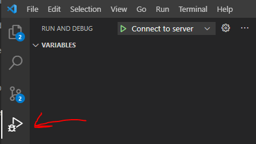
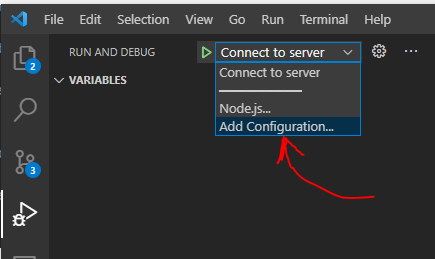

# Contributing to Terraform - Redfish Provider
You can submit a work in progress (WIP) pull request, or file an issue with the parts you know. We'll do our best to guide you in the right direction, and let you know if there are guidelines we will need to follow. We want people to be able to participate without fear of doing the wrong thing. We are also in the same boat as you :smiley:

Below are our expectations for contributors. Following these guidelines gives us
the best opportunity to work with you, by making sure we have the things we need
in order to make it happen. Doing your best to follow it will speed up our
ability to merge PRs and respond to issues.

- [Issue Reporting and Lifecycle](contributing/issue-reporting-and-lifecycle.md)
- [Pull Request Submission and Lifecycle](contributing/pullrequest-submission-and-lifecycle.md)

## Getting Started on Development

### How to Write Terraform Providers

Check out the [Terraform Provider Tutorial](https://learn.hashicorp.com/tutorials/terraform/provider-setup)

### Setting Up A Debugger

How to set up a debugger is described [on Terraform's website](https://www.terraform.io/docs/extend/debugging.html#enabling-debugging-in-a-provider)

**NOTE:** These instructions were written on Windows but port directly to Linux.

The following five steps are common to all setups regardless of which IDE you are using

1. In [main.go](../main.go) and fine the line:

        flag.BoolVar(&debugMode, "debug", false, "set to true to run the provider with support for debuggers like delve")

2. Change false to true and then recompile the provider with `go build -o terraform-provider-redfish.exe`
3. Install Delve with

        git clone https://github.com/go-delve/delve
        cd delve
        go install github.com/go-delve/delve/cmd/dlv

4. It will install to %GOPATH%. On Windows this defaults to `C:\Users\YOURNAME\go`.
5. `cd` to the directory with your provider binary and run `%GOPATH%\dlv.exe exec --headless --listen=:51706 --accept-multiclient --api-version=2 .\terraform-provider-redfish.exe -- --debug`

#### GoLand

1. Configure GoLand for remote debugging by following [these instructions](https://golangforall.
   com/en/post/go-docker-delve-remote-debug.html#goland-ide). Use the port from step #5
2. Run your GoLand debugging profile. If everything was configured correctly, you should see something like this on 
   the command line:

        C:\Users\grant\Documents\code\terraform-provider-redfish>dlv exec --headless --listen=:51706 --accept-multiclient --api-version=2 .\terraform-provider-redfish.exe -- --debug
        API server listening at: [::]:51706
        {"@level":"debug","@message":"plugin address","@timestamp":"2021-02-25T18:25:46.044480-05:00","address":"127.0.0.1:51865","network":"tcp"}
        Provider server started; to attach Terraform, set TF_REATTACH_PROVIDERS to the following:
        {"registry.terraform.io/dell/redfish":{"Protocol":"grpc","Pid":32044,"Test":true,"Addr":{"Network":"tcp","String":"127.0.0.1:51865"}}}

3. This means the debugger is up and running. Set your breakpoints as you please and then open a separate terminal 
   window for debugging. In that terminal window you need to create an environment variable using the `TF_REATTACH_PROVIDERS` from above. Create it like this on Windows: `set TF_REATTACH_PROVIDERS='{"registry.terraform.io/dell/redfish":{"Protocol":"grpc","Pid":32044,"Test":true,"Addr":{"Network":"tcp","String":"127.0.0.1:51865"}}}'`
4. Run your Terraform commands as usual.

#### Visual Studio Code

1. Configuring vscode for debugging GoLang is described [here](https://golangforall.com/en/post/go-docker-delve-remote-debug.html#visual-studio-code). Begin by going to the debug tab:

2. Next click add configuration:

3. Finally configure the file with the following:

        {
          // Use IntelliSense to learn about possible attributes.
          // Hover to view descriptions of existing attributes.
          // For more information, visit: https://go.microsoft.com/fwlink/?linkid=830387
          "version": "0.2.0",
          "configurations": [
            
            {
              "name": "Connect to server",
              "type": "go",
              "request": "attach",
              "mode": "remote",
              // remotePath works both on a remote server (across the network) or on your
              // localhost. Here it is the absolute path to your terraform-provider-redfish
              // folder
              "remotePath": "C:\\Users\\grant\\Documents\\code\\terraform-provider-redfish",
              // port and host on which you want the remote debugger to listen
              "port": 51706,
              "host": "127.0.0.1",
              "showLog": true,
              "trace": "verbose",
            }
          ]
        }

4. Run your vscode debugging profile. If everything was configured correctly, you should see something like this on the command line where you ran delve:

        C:\Users\grant\Documents\code\terraform-provider-redfish>dlv exec --headless --listen=:51706 --accept-multiclient --api-version=2 .\terraform-provider-redfish.exe -- --debug
        API server listening at: [::]:51706
        {"@level":"debug","@message":"plugin address","@timestamp":"2021-02-25T18:25:46.044480-05:00","address":"127.0.0.1:51865","network":"tcp"}
        Provider server started; to attach Terraform, set TF_REATTACH_PROVIDERS to the following:
        {"registry.terraform.io/dell/redfish":{"Protocol":"grpc","Pid":32044,"Test":true,"Addr":{"Network":"tcp","String":"127.0.0.1:51865"}}}

5. This means the debugger is up and running. Set your breakpoints as you please and then open a separate terminal window for debugging. In that terminal window you need to create an environment variable using the `TF_REATTACH_PROVIDERS` from above. Create it like this on Windows: `set TF_REATTACH_PROVIDERS='{"registry.terraform.io/dell/redfish":{"Protocol":"grpc","Pid":32044,"Test":true,"Addr":{"Network":"tcp","String":"127.0.0.1:51865"}}}'`
6. Run your Terraform commands as usual.